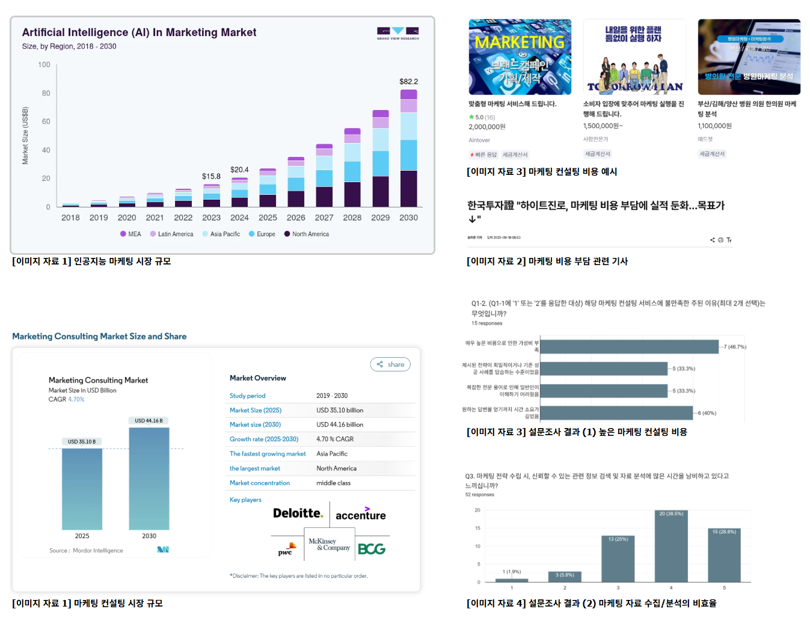

# 🧑‍💻 SKN17-4th-1Team: Axiom
> SK네트웍스 Family AI캠프 17기 - 4차 프로젝트 1팀  
  개발 기간: 2025.10.24 ~ 2025.10.27

 

# 📌 목차
1. [팀 소개](#1️⃣-팀-소개)  
2. [프로젝트 개요](#2️⃣-프로젝트-개요)  
3. [기술 스택](#3️⃣-기술-스택)  
4. [시스템 구성도](#4️⃣-시스템-구성도)  
5. [요구사항 정의서](#5️⃣-요구사항-정의서)  
6. [화면설계서](#6️⃣-화면설계서)  
7. [WBS](#7️⃣-WBS)
8. [테스트 계획 및 결과 보고서](#8️⃣-테스트-계획-및-결과-보고서)  
9. [수행 결과](#9️⃣-수행-결과)  
10. [한 줄 회고](#🔟-한-줄-회고)  

 
 

# 1️⃣ 팀 소개
#### ✅ **팀명: Axiom**
> 단순함이 궁극의 정교함이다

#### ✅ **팀원 소개**

| [@김주영](https://github.com/samkim7788)                      | [@김준협](https://github.com/use08168)                       |  [@맹지수](https://github.com/happyfrogg)                       | [@이민영](https://github.com/mylee99125)                       | [@조세희](https://github.com/tpgml6513)                       |
|---------------------------------------------------------------|---------------------------------------------------------------------|---------------------------------------------------------------------|---------------------------------------------------------------------|---------------------------------------------------------------------|
|          | |              |  ||

 
 

# 2️⃣ 프로젝트 개요

## ✅ 프로젝트 소개: Chative Jobs

**Chative Jobs**는 사용자의 마케팅 기획안에 대해, Apple의 마케팅 전략과 브랜딩 아이디어 기반으로 스티브 잡스에게 직접 컨설팅 받는 듯한 경험을 제공하는 **AI 기반 마케팅 컨설팅 챗봇**입니다.

 

## ✅ 프로젝트 필요성

출처: [https://www.mordorintelligence.kr/industry-reports/marketing-consulting-market](https://www.mordorintelligence.kr/industry-reports/marketing-consulting-market)
> 본 분석에 사용된 모든 수치는 **당사가 52명을 대상으로 진행한 '마케팅 전략 수립 비효율성'에 대한 자체 설문조사 결과**를 기반으로 합니다.

마케팅 컨설팅 시장은 매년 성장하여, 2025년에는 **약 35억 달러** 규모로 추산됩니다.  하지만 이러한 외형적 성장에도 불구하고, 기존 컨설팅 서비스는 고질적인 비효율성을 안고 있습니다.

### 아쉬운 점 1. 높은 비용

| 아쉬운 점 | 설문 결과 |
| :--- | :--- |
| **비용 민감도** | AI 기능에 지불 의향 있는 응답자 중 **90.5%가** 월 **10만원 미만을** 선호 (Q6-1)
| **가성비 불만** | 불만족 응답자의 **1순위 불만 사유**는 **매우 높은 비용으로 인한 가성비 부족**이었습니다.
---

### 아쉬운 점 2. 획일적 전략 & 내부 자료 활용 미흡

| 아쉬운 점 | 설문 결과 |
| :---- | :---- |
| **차별화된 전략의 요구** | **82.7%가** '브랜드의 가치와 비전 정의'가 **매우 중요하다**고 응답 (Q5, 4+5점)
| **내부 자료 활용 사각지대** | Q3에서 시간 낭비를 느낀 응답자 중 **85.7%가** '사내 자료 재활용에 어려움'을 겪는다고 응답 (Q3-1, 4+5점)

 

## ✅ Chative Job의 솔루션

저희 AI 챗봇은 **혁신성, 신뢰성, 효율성**을 결합하여 기존 컨설팅의 한계를 돌파합니다.

### 목표 1: 혁신적 전략 초안 및 신뢰성 확보

| AI 기능 | 가치 제안 |
| :--- | :--- | 
| **혁신적 전략 제시 (스티브잡스 페르소나)**  | 단순 통계 기반을 넘어, **스티브 잡스 페르소나** 기반의 **파괴적 혁신 아이디어**를 초기 전략 초안으로 제공 |
| **신뢰성 & 정확성 확보** |  **RAG 기술**을 활용하여 학술 자료 및 최신 데이터에 기반한 답변의 **신뢰도와 정확성**을 극대화 |

### 목표 2: 사용자 친화적이고 효율적인 마케팅 전략 분석

| AI 기능 | 가치 제안 |
| :--- | :--- | 
| **기획안(PDF) 요약 및 분석** | **복잡한 내부 기획안(PDF)을** 간편하게 업로드하면, AI가 **핵심 요약 및 보완점**을 분석하여 사용자의 질문에 응답하여 사용자 시간을 절약|
| **사용자 중심 가격 정책** | **초기 전략:** 사용자 유입 극대화를 위한 **무료 서비스 배포** 및 **광고 수익 모델** 우선 적용   **향후 전략:** **중소기업/스타트업**이 부담 없이 사용할 수 있는 **합리적인 구독료** 모델을 추후 도입할 수 있는 기반 마련 |
    

 
 

# 3️⃣ 기술 스택

| 카테고리 | 기술 스택 |
|----------|-------------------------------------------|
| **사용 언어** |  |
| **프레임워크** |  |
| **LLM** |  |
| **벡터 데이터베이스** |  |
| **임베딩 모델** |  |
| **모델 튜닝/학습 프레임워크** |    |
| **프론트엔드** |    |
| **실행 환경** |   |
| **배포 및 컨테이너** |    |
| **DB 및 기타** |   |
| **형상 관리 및 협업** |     |
| **테스트** |  |

 
 

# 4️⃣ 시스템 구성도

 
 

# 5️⃣ 요구사항 정의서

**✅ 사용자 관련 요구사항:**
사용자는 로그인, 회원가입, 개인정보 수정을 할 수 있어야 한다.

**✅ 채팅 관련 요구사항:**
사용자는 Chative Jobs 시스템을 통해 PDF 업로드 및 질의응답 채팅을 할 수 있어야 한다.

**✅ 히스토리 관련 요구사항:**
사용자의 파일 및 채팅 기록은 저장, 접근 가능해야한다.

---

 
 

# 6️⃣ 화면설계서

[✅ 화면 설계서 바로가기](https://docs.google.com/presentation/d/10oxuHBTXadnlJ9JGtmlaPrudTjYlZZQR/edit?usp=sharing&ouid=103468688069912495528&rtpof=true&sd=true)

전체 화면 설계서

 

**- 메인 홈 화면**

 

**- 회원가입/로그인/비밀번호 찾기**

 

**- 회원 채팅**

 

**- 개인정보 설정**

 

 
 

# 7️⃣ WBS

 
 

# 8️⃣ 테스트 계획 및 결과 보고서
### 테스트 계획서
 

테스트 시나리오

 

**- 단위 테스트**

 

**- 통합 테스트**

 

### 테스트 결과 보고서

 

## 한계점 및 향후 개선 계획

---

 
 

# 9️⃣ 수행 결과

 
 
 

# 🔟 한 줄 회고
| 항목 | 내용 |
|------|------|
| 김주영 |  |
| 김준협 |  |
| 맹지수 |  |
| 이민영 |  |
| 조세희 |  |

 
